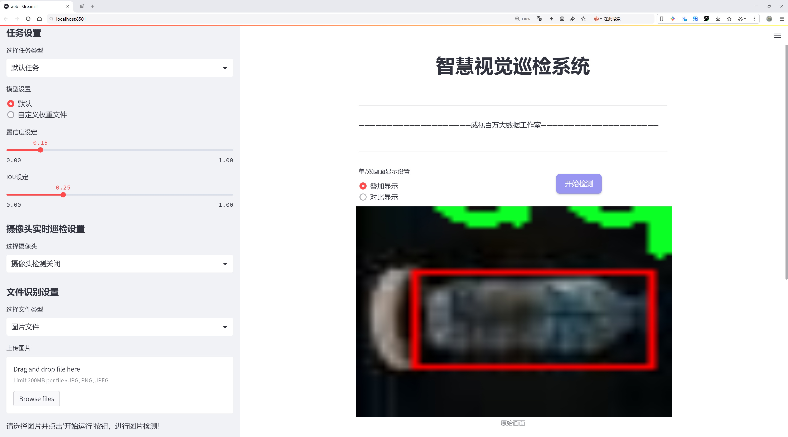
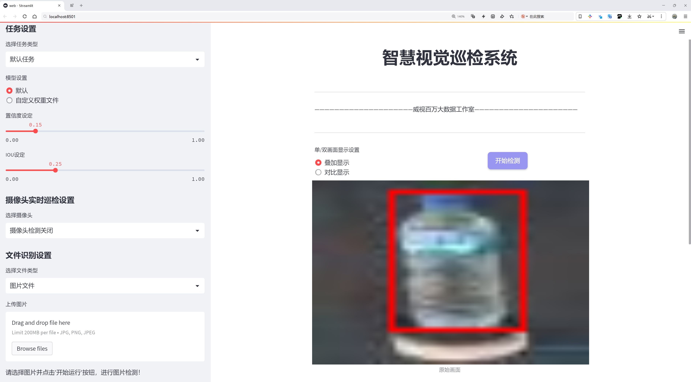
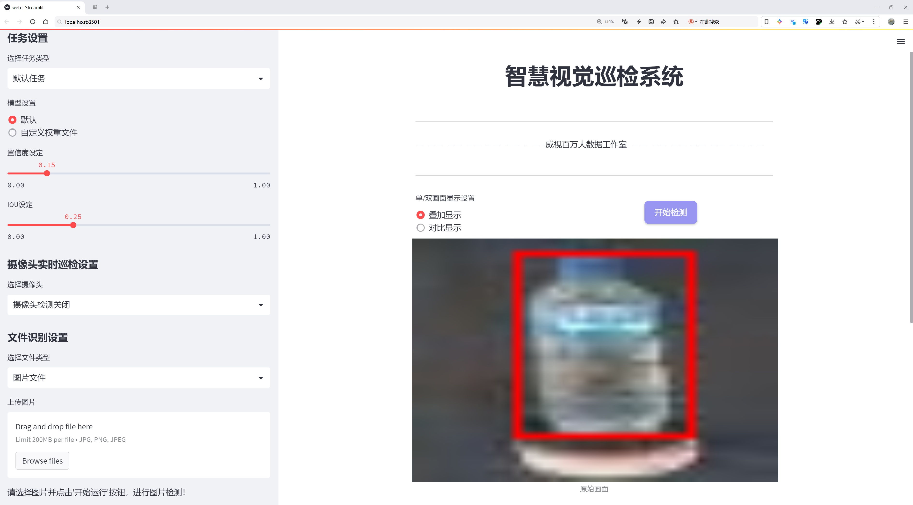
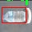
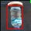
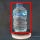
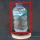
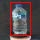

# 水质污染监测检测系统源码分享
 # [一条龙教学YOLOV8标注好的数据集一键训练_70+全套改进创新点发刊_Web前端展示]

### 1.研究背景与意义

项目参考[AAAI Association for the Advancement of Artificial Intelligence](https://gitee.com/qunshansj/projects)

项目来源[AACV Association for the Advancement of Computer Vision](https://gitee.com/qunmasj/projects)

研究背景与意义

随着全球工业化进程的加速和城市化的不断推进，水质污染问题日益严重，成为制约人类可持续发展的重要因素之一。水体污染不仅对生态环境造成了深远的影响，还直接威胁到人类的健康和生存。根据世界卫生组织的统计，全球每年因水污染导致的疾病和死亡人数不计其数，尤其是在发展中国家，水质问题更是引发了广泛的社会关注。因此，建立高效、准确的水质监测系统，及时发现和处理水质污染事件，显得尤为重要。

在这一背景下，计算机视觉技术的快速发展为水质监测提供了新的解决方案。YOLO（You Only Look Once）系列模型因其在目标检测任务中的高效性和准确性，逐渐成为研究者们关注的焦点。YOLOv8作为该系列的最新版本，具有更强的特征提取能力和更快的推理速度，能够在复杂环境中实现实时目标检测。通过对YOLOv8模型的改进，可以更好地适应水质监测的需求，提升水质污染的检测精度和响应速度。

本研究基于改进YOLOv8模型，构建一个水质污染监测系统，旨在通过图像识别技术实现对水体状态的实时监测。我们所使用的数据集包含1536张图像，分为正常水质（aqua_normal）和受污染水质（aqua_rusak）两类。这一数据集的构建为模型的训练和验证提供了坚实的基础。通过对不同水质状态的图像进行标注和分类，研究者能够利用深度学习算法提取出水质变化的关键特征，从而实现对水质的智能监测。

改进YOLOv8模型的应用，不仅能够提高水质监测的效率，还能在实际应用中降低人工成本，减少人为因素对监测结果的影响。此外，基于计算机视觉的水质监测系统能够实现大范围的水体监测，适用于河流、湖泊、水库等多种水体环境，具有广泛的应用前景。

本研究的意义在于，首先为水质监测提供了一种新的技术手段，推动了水质监测领域的技术进步；其次，通过改进YOLOv8模型，提升了水质污染检测的准确性和实时性，为相关部门提供了科学依据，帮助其制定更有效的水质管理政策；最后，研究成果有望为未来的智能环境监测系统的构建提供参考，促进水资源的可持续利用和生态环境的保护。

综上所述，基于改进YOLOv8的水质污染监测系统不仅具有重要的理论价值，也具备广泛的实际应用潜力，能够为解决日益严峻的水质污染问题提供有效的技术支持。

### 2.图片演示







##### 注意：由于此博客编辑较早，上面“2.图片演示”和“3.视频演示”展示的系统图片或者视频可能为老版本，新版本在老版本的基础上升级如下：（实际效果以升级的新版本为准）

  （1）适配了YOLOV8的“目标检测”模型和“实例分割”模型，通过加载相应的权重（.pt）文件即可自适应加载模型。

  （2）支持“图片识别”、“视频识别”、“摄像头实时识别”三种识别模式。

  （3）支持“图片识别”、“视频识别”、“摄像头实时识别”三种识别结果保存导出，解决手动导出（容易卡顿出现爆内存）存在的问题，识别完自动保存结果并导出到tempDir中。

  （4）支持Web前端系统中的标题、背景图等自定义修改，后面提供修改教程。

  另外本项目提供训练的数据集和训练教程,暂不提供权重文件（best.pt）,需要您按照教程进行训练后实现图片演示和Web前端界面演示的效果。

### 3.视频演示

[3.1 视频演示](https://www.bilibili.com/video/BV12u4YecEwt/)

### 4.数据集信息展示

##### 4.1 本项目数据集详细数据（类别数＆类别名）

nc: 2
names: ['aqua_normal', 'aqua_rusak']


##### 4.2 本项目数据集信息介绍

数据集信息展示

在水质污染监测系统的研究中，数据集的选择与构建至关重要。本研究所采用的数据集名为“aqua”，专门用于训练和改进YOLOv8模型，以实现对水质污染的高效监测与识别。该数据集的设计旨在涵盖水体中正常状态与污染状态的多样性，提供丰富的样本以支持模型的学习与泛化能力。

“aqua”数据集包含两个主要类别，分别为“aqua_normal”和“aqua_rusak”。“aqua_normal”类别代表水质良好的样本，这些样本通常包括清澈的水体、无污染的生态环境以及健康的水生生物。通过对这一类别的样本进行分析，研究人员能够了解正常水质的特征，进而为后续的污染检测提供基准。这一类别的样本不仅包括静态图像，还涵盖了不同时间、不同光照条件下的动态场景，以确保模型能够在各种环境下准确识别正常水质。

另一方面，“aqua_rusak”类别则聚焦于水质受到污染的样本。这些样本可能包含有害物质的迹象，如水体浑浊、异物漂浮、藻类大量繁殖等现象。通过对这一类别的深入研究，研究人员能够识别出污染的具体特征和模式，为水质监测提供有力的支持。该类别的样本同样考虑了多种环境因素，如不同的污染源、季节变化以及人类活动对水质的影响，从而增强模型在实际应用中的适应性。

数据集“aqua”的构建不仅注重样本的多样性与代表性，还充分考虑了数据的标注质量。每个样本都经过严格的标注过程，确保类别标签的准确性与一致性。这一过程涉及多位领域专家的参与，确保数据集的科学性与可靠性。此外，为了提升模型的训练效果，数据集还采用了数据增强技术，通过旋转、缩放、裁剪等手段，增加样本的多样性，从而提升模型的鲁棒性。

在数据集的使用过程中，研究人员将“aqua”数据集分为训练集、验证集和测试集，以便于模型的训练与评估。训练集用于模型的学习，验证集用于调整模型参数，而测试集则用于最终的性能评估。这种分割方式确保了模型在未知数据上的泛化能力，能够有效应对实际应用中的各种挑战。

总之，“aqua”数据集为水质污染监测系统的研究提供了坚实的基础，通过对正常与污染水质样本的全面覆盖，助力YOLOv8模型的改进与优化。随着数据集的不断扩展与更新，未来的研究将能够更好地应对水质监测中的复杂性与多变性，为环境保护与可持续发展贡献更大的力量。











### 5.全套项目环境部署视频教程（零基础手把手教学）

[5.1 环境部署教程链接（零基础手把手教学）](https://www.ixigua.com/7404473917358506534?logTag=c807d0cbc21c0ef59de5)


[5.2 安装Python虚拟环境创建和依赖库安装视频教程链接（零基础手把手教学）](https://www.ixigua.com/7404474678003106304?logTag=1f1041108cd1f708b01a)

### 6.手把手YOLOV8训练视频教程（零基础小白有手就能学会）

[6.1 手把手YOLOV8训练视频教程（零基础小白有手就能学会）](https://www.ixigua.com/7404477157818401292?logTag=d31a2dfd1983c9668658)

### 7.70+种全套YOLOV8创新点代码加载调参视频教程（一键加载写好的改进模型的配置文件）

[7.1 70+种全套YOLOV8创新点代码加载调参视频教程（一键加载写好的改进模型的配置文件）](https://www.ixigua.com/7404478314661806627?logTag=29066f8288e3f4eea3a4)

### 8.70+种全套YOLOV8创新点原理讲解（非科班也可以轻松写刊发刊，V10版本正在科研待更新）

由于篇幅限制，每个创新点的具体原理讲解就不一一展开，具体见下列网址中的创新点对应子项目的技术原理博客网址【Blog】：


[8.1 70+种全套YOLOV8创新点原理讲解链接](https://gitee.com/qunmasj/good)

### 9.系统功能展示（检测对象为举例，实际内容以本项目数据集为准）

图9.1.系统支持检测结果表格显示

  图9.2.系统支持置信度和IOU阈值手动调节

  图9.3.系统支持自定义加载权重文件best.pt(需要你通过步骤5中训练获得)

  图9.4.系统支持摄像头实时识别

  图9.5.系统支持图片识别

  图9.6.系统支持视频识别

  图9.7.系统支持识别结果文件自动保存

  图9.8.系统支持Excel导出检测结果数据


### 10.原始YOLOV8算法原理

原始YOLOv8算法原理

YOLOv8作为YOLO系列的最新版本，继承并发展了前几代模型的核心思想，旨在实现高效、准确的目标检测。其设计理念是将目标检测问题转化为一个回归问题，通过一个单一的神经网络同时预测目标的位置和类别。这种一阶段的检测框架使得YOLOv8在实时性和准确性之间找到了良好的平衡。

YOLOv8的网络结构主要由三个部分组成：输入端、主干网络（Backbone）和检测头（Head）。在主干网络方面，YOLOv8继续采用CSP（Cross Stage Partial）网络的思想，以提高特征提取的效率和准确性。相较于前几代，YOLOv8引入了C2f模块，这一模块在C3模块的基础上进行了改进，结合了YOLOv7中的ELAN（Efficient Layer Aggregation Network）模块的设计理念。C2f模块通过增加更多的残差连接，增强了梯度流的丰富性，使得模型在保持轻量化的同时，能够获得更深层次的特征信息。这种设计不仅提升了模型的性能，还有效减少了计算资源的消耗。

在特征增强网络（Neck）中，YOLOv8采用了PAN-FPN（Path Aggregation Network - Feature Pyramid Network）的结构，这一结构通过不同层次特征的融合，增强了模型对多尺度目标的检测能力。值得注意的是，YOLOv8在特征增强部分删除了上采样前的卷积结构，这一改动进一步简化了网络结构，提高了计算效率。

检测头部分是YOLOv8的一大创新之处。YOLOv8采用了解耦合头结构，将分类和回归任务分为两个独立的分支。这样的设计使得模型能够更专注于各自的任务，从而提高了在复杂场景下的定位精度和分类准确性。通过解耦，YOLOv8能够更有效地处理目标检测中的不同任务需求，尤其是在目标密集和背景复杂的情况下，表现出色。此外，YOLOv8引入了Anchor-Free的目标检测方法，摒弃了传统的锚框设计，直接预测目标的中心位置和大小。这种方法不仅简化了模型的设计，还提高了模型对不同尺度和形状目标的适应能力。

在训练过程中，YOLOv8采用了一系列新的数据增强策略，以提升模型的鲁棒性和泛化能力。特别是在训练的最后10个epoch中，YOLOv8停止使用马赛克增强，这一决策是基于对数据真实分布的考虑，旨在避免模型学习到不良信息。同时，YOLOv8还引入了动态的Task-Aligned Assigner样本分配策略，通过对正负样本的有效区分，进一步提升了模型的训练效果。

在损失函数的设计上，YOLOv8采用了BCELoss作为分类损失，DFLLoss和CIoULoss作为回归损失。这种组合损失函数的设计，旨在同时优化分类和定位的性能，使得模型在训练过程中能够更好地平衡这两项任务的需求。

YOLOv8在性能上相较于前几代模型有了显著提升。通过对网络结构的优化和损失函数的改进，YOLOv8在COCO数据集上的表现尤为突出，尤其是在mAP（mean Average Precision）指标上，展现了更高的准确性和更快的推理速度。模型的轻量化设计使得YOLOv8能够在嵌入式设备上高效运行，满足实时检测的需求。

综上所述，YOLOv8通过对网络结构的创新和训练策略的优化，展现了其在目标检测领域的强大能力。其解耦合头、Anchor-Free设计、动态样本分配策略以及优化的损失函数，使得YOLOv8在准确性和实时性之间找到了理想的平衡，成为当前目标检测任务中的一项重要工具。随着YOLOv8的不断发展和应用，其在各类实际场景中的表现将进一步验证其设计理念的有效性和优越性。


### 11.项目核心源码讲解（再也不用担心看不懂代码逻辑）

#### 11.1 ui.py

```python
import sys
import subprocess

def run_script(script_path):
    """
    使用当前 Python 环境运行指定的脚本。

    Args:
        script_path (str): 要运行的脚本路径

    Returns:
        None
    """
    # 获取当前 Python 解释器的路径
    python_path = sys.executable

    # 构建运行命令，使用 streamlit 运行指定的脚本
    command = f'"{python_path}" -m streamlit run "{script_path}"'

    # 执行命令
    result = subprocess.run(command, shell=True)
    # 检查命令执行结果，如果返回码不为0，则表示出错
    if result.returncode != 0:
        print("脚本运行出错。")

# 主程序入口
if __name__ == "__main__":
    # 指定要运行的脚本路径
    script_path = "web.py"  # 这里可以替换为实际的脚本路径

    # 调用函数运行脚本
    run_script(script_path)
```

### 代码注释说明：
1. **导入模块**：
   - `sys`：用于获取当前 Python 解释器的路径。
   - `subprocess`：用于执行外部命令。

2. **定义 `run_script` 函数**：
   - 该函数接受一个参数 `script_path`，表示要运行的 Python 脚本的路径。
   - 使用 `sys.executable` 获取当前 Python 解释器的路径。
   - 构建一个命令字符串，使用 `streamlit` 模块运行指定的脚本。
   - 使用 `subprocess.run` 执行构建的命令，并检查返回码以判断脚本是否成功运行。

3. **主程序入口**：
   - 使用 `if __name__ == "__main__":` 确保只有在直接运行该脚本时才会执行以下代码。
   - 指定要运行的脚本路径（在这里是 `web.py`）。
   - 调用 `run_script` 函数来执行指定的脚本。

这个程序文件名为 `ui.py`，其主要功能是通过当前的 Python 环境运行一个指定的脚本，具体是一个名为 `web.py` 的文件。程序首先导入了必要的模块，包括 `sys`、`os` 和 `subprocess`，以及一个自定义的路径处理模块 `abs_path`。

在程序中定义了一个名为 `run_script` 的函数，该函数接受一个参数 `script_path`，表示要运行的脚本的路径。函数内部首先获取当前 Python 解释器的路径，使用 `sys.executable` 获取当前 Python 环境的可执行文件路径。接着，构建一个命令字符串，使用 `streamlit` 模块来运行指定的脚本。命令的格式为 `"{python_path}" -m streamlit run "{script_path}"`，其中 `python_path` 是当前 Python 解释器的路径，`script_path` 是要运行的脚本路径。

随后，程序使用 `subprocess.run` 方法执行构建好的命令。这个方法会在一个新的 shell 中运行命令，并等待命令执行完成。如果命令执行的返回码不为 0，表示脚本运行出错，程序会打印出相应的错误信息。

在文件的最后部分，程序通过 `if __name__ == "__main__":` 语句来判断是否是直接运行该脚本。如果是，则指定要运行的脚本路径为 `web.py`，并调用 `run_script` 函数来执行该脚本。为了确保脚本路径是绝对路径，使用了 `abs_path` 函数来处理。

总的来说，这个程序的主要目的是方便用户在当前 Python 环境中运行一个 Streamlit 应用，确保脚本路径的正确性，并处理可能出现的错误。

#### 11.2 code\ultralytics\utils\tal.py

以下是代码中最核心的部分，并附上详细的中文注释：

```python
import torch
import torch.nn as nn

class TaskAlignedAssigner(nn.Module):
    """
    任务对齐分配器，用于目标检测。

    该类根据任务对齐指标将真实目标（gt）分配给锚点，该指标结合了分类和定位信息。

    属性：
        topk (int): 考虑的候选目标数量。
        num_classes (int): 目标类别数量。
        alpha (float): 分类组件的alpha参数。
        beta (float): 定位组件的beta参数。
        eps (float): 防止除以零的小值。
    """

    def __init__(self, topk=13, num_classes=80, alpha=1.0, beta=6.0, eps=1e-9):
        """初始化任务对齐分配器对象，设置可调超参数。"""
        super().__init__()
        self.topk = topk  # 选择的候选目标数量
        self.num_classes = num_classes  # 类别数量
        self.bg_idx = num_classes  # 背景类别索引
        self.alpha = alpha  # 分类指标的权重
        self.beta = beta  # 定位指标的权重
        self.eps = eps  # 防止除零的值

    @torch.no_grad()
    def forward(self, pd_scores, pd_bboxes, anc_points, gt_labels, gt_bboxes, mask_gt):
        """
        计算任务对齐分配。

        参数：
            pd_scores (Tensor): 预测分数，形状为(bs, num_total_anchors, num_classes)
            pd_bboxes (Tensor): 预测边界框，形状为(bs, num_total_anchors, 4)
            anc_points (Tensor): 锚点坐标，形状为(num_total_anchors, 2)
            gt_labels (Tensor): 真实标签，形状为(bs, n_max_boxes, 1)
            gt_bboxes (Tensor): 真实边界框，形状为(bs, n_max_boxes, 4)
            mask_gt (Tensor): 真实目标掩码，形状为(bs, n_max_boxes, 1)

        返回：
            target_labels (Tensor): 目标标签，形状为(bs, num_total_anchors)
            target_bboxes (Tensor): 目标边界框，形状为(bs, num_total_anchors, 4)
            target_scores (Tensor): 目标分数，形状为(bs, num_total_anchors, num_classes)
            fg_mask (Tensor): 前景掩码，形状为(bs, num_total_anchors)
            target_gt_idx (Tensor): 目标真实索引，形状为(bs, num_total_anchors)
        """
        self.bs = pd_scores.size(0)  # 批次大小
        self.n_max_boxes = gt_bboxes.size(1)  # 最大边界框数量

        if self.n_max_boxes == 0:  # 如果没有真实目标
            device = gt_bboxes.device
            return (
                torch.full_like(pd_scores[..., 0], self.bg_idx).to(device),  # 返回背景标签
                torch.zeros_like(pd_bboxes).to(device),  # 返回零边界框
                torch.zeros_like(pd_scores).to(device),  # 返回零分数
                torch.zeros_like(pd_scores[..., 0]).to(device),  # 返回零前景掩码
                torch.zeros_like(pd_scores[..., 0]).to(device),  # 返回零目标索引
            )

        # 获取正样本掩码、对齐指标和重叠度
        mask_pos, align_metric, overlaps = self.get_pos_mask(
            pd_scores, pd_bboxes, gt_labels, gt_bboxes, anc_points, mask_gt
        )

        # 选择重叠度最高的目标
        target_gt_idx, fg_mask, mask_pos = self.select_highest_overlaps(mask_pos, overlaps, self.n_max_boxes)

        # 获取目标标签、边界框和分数
        target_labels, target_bboxes, target_scores = self.get_targets(gt_labels, gt_bboxes, target_gt_idx, fg_mask)

        # 归一化对齐指标
        align_metric *= mask_pos
        pos_align_metrics = align_metric.amax(dim=-1, keepdim=True)  # 获取每个样本的最大对齐指标
        pos_overlaps = (overlaps * mask_pos).amax(dim=-1, keepdim=True)  # 获取每个样本的最大重叠度
        norm_align_metric = (align_metric * pos_overlaps / (pos_align_metrics + self.eps)).amax(-2).unsqueeze(-1)
        target_scores = target_scores * norm_align_metric  # 更新目标分数

        return target_labels, target_bboxes, target_scores, fg_mask.bool(), target_gt_idx  # 返回结果

    def get_pos_mask(self, pd_scores, pd_bboxes, gt_labels, gt_bboxes, anc_points, mask_gt):
        """获取正样本掩码。"""
        mask_in_gts = self.select_candidates_in_gts(anc_points, gt_bboxes)  # 选择在真实目标中的锚点
        align_metric, overlaps = self.get_box_metrics(pd_scores, pd_bboxes, gt_labels, gt_bboxes, mask_in_gts * mask_gt)  # 计算对齐指标和重叠度
        mask_topk = self.select_topk_candidates(align_metric, topk_mask=mask_gt.expand(-1, -1, self.topk).bool())  # 选择top-k候选
        mask_pos = mask_topk * mask_in_gts * mask_gt  # 合并掩码

        return mask_pos, align_metric, overlaps  # 返回正样本掩码、对齐指标和重叠度

    def get_box_metrics(self, pd_scores, pd_bboxes, gt_labels, gt_bboxes, mask_gt):
        """计算给定预测和真实边界框的对齐指标。"""
        na = pd_bboxes.shape[-2]  # 锚点数量
        mask_gt = mask_gt.bool()  # 转换为布尔类型
        overlaps = torch.zeros([self.bs, self.n_max_boxes, na], dtype=pd_bboxes.dtype, device=pd_bboxes.device)  # 初始化重叠度
        bbox_scores = torch.zeros([self.bs, self.n_max_boxes, na], dtype=pd_scores.dtype, device=pd_scores.device)  # 初始化边界框分数

        ind = torch.zeros([2, self.bs, self.n_max_boxes], dtype=torch.long)  # 初始化索引
        ind[0] = torch.arange(end=self.bs).view(-1, 1).expand(-1, self.n_max_boxes)  # 批次索引
        ind[1] = gt_labels.squeeze(-1)  # 真实标签索引
        bbox_scores[mask_gt] = pd_scores[ind[0], :, ind[1]][mask_gt]  # 获取每个网格的分数

        # 计算重叠度
        pd_boxes = pd_bboxes.unsqueeze(1).expand(-1, self.n_max_boxes, -1, -1)[mask_gt]
        gt_boxes = gt_bboxes.unsqueeze(2).expand(-1, -1, na, -1)[mask_gt]
        overlaps[mask_gt] = self.iou_calculation(gt_boxes, pd_boxes)  # 计算IoU

        align_metric = bbox_scores.pow(self.alpha) * overlaps.pow(self.beta)  # 计算对齐指标
        return align_metric, overlaps  # 返回对齐指标和重叠度

    def iou_calculation(self, gt_bboxes, pd_bboxes):
        """计算水平边界框的IoU。"""
        return bbox_iou(gt_bboxes, pd_bboxes, xywh=False, CIoU=True).squeeze(-1).clamp_(0)  # 计算IoU并限制为非负值

    def select_topk_candidates(self, metrics, largest=True, topk_mask=None):
        """根据给定指标选择top-k候选。"""
        topk_metrics, topk_idxs = torch.topk(metrics, self.topk, dim=-1, largest=largest)  # 获取top-k指标和索引
        if topk_mask is None:
            topk_mask = (topk_metrics.max(-1, keepdim=True)[0] > self.eps).expand_as(topk_idxs)  # 创建掩码
        topk_idxs.masked_fill_(~topk_mask, 0)  # 过滤无效索引

        count_tensor = torch.zeros(metrics.shape, dtype=torch.int8, device=topk_idxs.device)  # 初始化计数张量
        ones = torch.ones_like(topk_idxs[:, :, :1], dtype=torch.int8, device=topk_idxs.device)  # 创建全1张量
        for k in range(self.topk):
            count_tensor.scatter_add_(-1, topk_idxs[:, :, k : k + 1], ones)  # 统计每个索引的出现次数
        count_tensor.masked_fill_(count_tensor > 1, 0)  # 过滤重复的边界框

        return count_tensor.to(metrics.dtype)  # 返回计数张量

    def get_targets(self, gt_labels, gt_bboxes, target_gt_idx, fg_mask):
        """计算正样本的目标标签、边界框和分数。"""
        batch_ind = torch.arange(end=self.bs, dtype=torch.int64, device=gt_labels.device)[..., None]  # 批次索引
        target_gt_idx = target_gt_idx + batch_ind * self.n_max_boxes  # 计算目标真实索引
        target_labels = gt_labels.long().flatten()[target_gt_idx]  # 获取目标标签

        target_bboxes = gt_bboxes.view(-1, gt_bboxes.shape[-1])[target_gt_idx]  # 获取目标边界框

        target_labels.clamp_(0)  # 限制标签为非负值

        target_scores = torch.zeros(
            (target_labels.shape[0], target_labels.shape[1], self.num_classes),
            dtype=torch.int64,
            device=target_labels.device,
        )  # 初始化目标分数
        target_scores.scatter_(2, target_labels.unsqueeze(-1), 1)  # 根据标签设置分数

        fg_scores_mask = fg_mask[:, :, None].repeat(1, 1, self.num_classes)  # 创建前景分数掩码
        target_scores = torch.where(fg_scores_mask > 0, target_scores, 0)  # 应用掩码

        return target_labels, target_bboxes, target_scores  # 返回目标标签、边界框和分数

    @staticmethod
    def select_candidates_in_gts(xy_centers, gt_bboxes, eps=1e-9):
        """选择在真实目标中的正样本锚点。"""
        n_anchors = xy_centers.shape[0]  # 锚点数量
        bs, n_boxes, _ = gt_bboxes.shape  # 批次大小和边界框数量
        lt, rb = gt_bboxes.view(-1, 1, 4).chunk(2, 2)  # 左上角和右下角
        bbox_deltas = torch.cat((xy_centers[None] - lt, rb - xy_centers[None]), dim=2).view(bs, n_boxes, n_anchors, -1)  # 计算边界框的偏差
        return bbox_deltas.amin(3).gt_(eps)  # 返回在边界框内的锚点

    @staticmethod
    def select_highest_overlaps(mask_pos, overlaps, n_max_boxes):
        """选择重叠度最高的目标。"""
        fg_mask = mask_pos.sum(-2)  # 计算前景掩码
        if fg_mask.max() > 1:  # 如果一个锚点被多个真实目标分配
            mask_multi_gts = (fg_mask.unsqueeze(1) > 1).expand(-1, n_max_boxes, -1)  # 创建多目标掩码
            max_overlaps_idx = overlaps.argmax(1)  # 获取最大重叠度索引

            is_max_overlaps = torch.zeros(mask_pos.shape, dtype=mask_pos.dtype, device=mask_pos.device)  # 初始化最大重叠度掩码
            is_max_overlaps.scatter_(1, max_overlaps_idx.unsqueeze(1), 1)  # 设置最大重叠度位置为1

            mask_pos = torch.where(mask_multi_gts, is_max_overlaps, mask_pos).float()  # 更新掩码
            fg_mask = mask_pos.sum(-2)  # 更新前景掩码
        target_gt_idx = mask_pos.argmax(-2)  # 获取每个锚点对应的真实目标索引
        return target_gt_idx, fg_mask, mask_pos  # 返回目标索引、前景掩码和正样本掩码
```

### 代码核心部分说明
1. **TaskAlignedAssigner 类**：该类是目标检测中的一个重要组件，负责将真实目标与锚点进行匹配。它使用任务对齐指标来综合考虑分类和定位信息。
2. **forward 方法**：主计算逻辑，接受预测分数、边界框、锚点、真实标签和边界框等输入，返回目标标签、边界框、分数、前景掩码和目标索引。
3. **get_pos_mask 方法**：计算正样本掩码，确定哪些锚点与真实目标相匹配。
4. **get_box_metrics 方法**：计算对齐指标和重叠度，使用IoU（Intersection over Union）来评估预测边界框与真实边界框的重叠情况。
5. **get_targets 方法**：根据匹配结果生成目标标签、边界框和分数。
6. **select_candidates_in_gts 方法**：选择在真实目标内的锚点，确保只考虑有效的锚点。
7. **select_highest_overlaps 方法**：处理锚点与多个真实目标的重叠情况，确保每个锚点只分配给重叠度最高的真实目标。

这些核心部分构成了目标检测模型中锚点分配的基础逻辑。

这个程序文件定义了一个用于目标检测的任务对齐分配器（TaskAlignedAssigner），以及一些相关的辅助函数和类。它的主要功能是将真实目标（ground-truth）分配给锚框（anchors），并基于分类和定位信息的结合来计算分配的质量。

首先，程序导入了必要的库，包括PyTorch和一些自定义的模块。然后，定义了`TaskAlignedAssigner`类，该类继承自`nn.Module`，并在初始化时设置了一些超参数，如考虑的候选框数量（topk）、类别数量（num_classes）、分类和定位的权重（alpha和beta）以及防止除零的微小值（eps）。

在`forward`方法中，程序接收预测的分数、边界框、锚点、真实标签和边界框等信息，并计算任务对齐的分配。首先，检查是否有真实目标，如果没有，则返回相应的背景标签和零值的边界框和分数。接着，调用`get_pos_mask`方法获取正样本的掩码、对齐度量和重叠度量。然后，通过`select_highest_overlaps`方法选择重叠度量最高的目标，并获取目标标签、边界框和分数。最后，对对齐度量进行归一化处理，并返回目标标签、边界框、分数、前景掩码和目标索引。

`get_pos_mask`方法用于获取正样本的掩码，计算对齐度量和重叠度量。`get_box_metrics`方法则计算预测边界框和真实边界框之间的对齐度量，使用`iou_calculation`方法计算交并比（IoU）。`select_topk_candidates`方法用于根据给定的度量选择前k个候选框。

此外，程序还定义了一个`RotatedTaskAlignedAssigner`类，专门处理旋转边界框的情况，重写了`iou_calculation`和`select_candidates_in_gts`方法，以适应旋转框的计算。

最后，程序提供了一些辅助函数，如`make_anchors`用于生成锚框，`dist2bbox`和`bbox2dist`用于在锚框和边界框之间进行转换，`dist2rbox`用于解码预测的旋转边界框坐标。

整体来看，这个文件实现了一个复杂的目标检测分配机制，能够有效地将真实目标与锚框进行匹配，为后续的目标检测任务提供支持。

#### 11.3 70+种YOLOv8算法改进源码大全和调试加载训练教程（非必要）\ultralytics\nn\backbone\CSwomTramsformer.py

以下是经过简化和注释的核心代码部分，保留了CSWin Transformer的主要结构和功能：

```python
import torch
import torch.nn as nn
import numpy as np

class Mlp(nn.Module):
    """多层感知机（MLP）模块"""
    def __init__(self, in_features, hidden_features=None, out_features=None, act_layer=nn.GELU, drop=0.):
        super().__init__()
        out_features = out_features or in_features  # 输出特征数
        hidden_features = hidden_features or in_features  # 隐藏层特征数
        self.fc1 = nn.Linear(in_features, hidden_features)  # 第一层线性变换
        self.act = act_layer()  # 激活函数
        self.fc2 = nn.Linear(hidden_features, out_features)  # 第二层线性变换
        self.drop = nn.Dropout(drop)  # Dropout层

    def forward(self, x):
        """前向传播"""
        x = self.fc1(x)
        x = self.act(x)
        x = self.drop(x)
        x = self.fc2(x)
        x = self.drop(x)
        return x

class CSWinBlock(nn.Module):
    """CSWin Transformer的基本块"""
    def __init__(self, dim, num_heads, mlp_ratio=4., drop=0., attn_drop=0.):
        super().__init__()
        self.dim = dim  # 输入特征维度
        self.num_heads = num_heads  # 注意力头数
        self.mlp_ratio = mlp_ratio  # MLP比例
        self.qkv = nn.Linear(dim, dim * 3)  # 线性变换生成Q、K、V
        self.norm1 = nn.LayerNorm(dim)  # 第一层归一化
        self.attn = LePEAttention(dim, num_heads=num_heads, attn_drop=attn_drop)  # 注意力机制
        self.mlp = Mlp(in_features=dim, hidden_features=int(dim * mlp_ratio), out_features=dim)  # MLP
        self.norm2 = nn.LayerNorm(dim)  # 第二层归一化

    def forward(self, x):
        """前向传播"""
        x = self.norm1(x)  # 归一化
        qkv = self.qkv(x).reshape(x.shape[0], -1, 3, self.dim).permute(2, 0, 1, 3)  # 生成Q、K、V
        x = self.attn(qkv)  # 注意力计算
        x = x + self.mlp(self.norm2(x))  # MLP计算
        return x

class CSWinTransformer(nn.Module):
    """CSWin Transformer模型"""
    def __init__(self, img_size=640, in_chans=3, num_classes=1000, embed_dim=96, depth=[2, 2, 6, 2], num_heads=12):
        super().__init__()
        self.num_classes = num_classes
        self.embed_dim = embed_dim  # 嵌入维度

        # 输入层
        self.stage1_conv_embed = nn.Sequential(
            nn.Conv2d(in_chans, embed_dim, kernel_size=7, stride=4, padding=2),
            nn.LayerNorm(embed_dim)
        )

        # 各个阶段的块
        self.stage1 = nn.ModuleList([
            CSWinBlock(dim=embed_dim, num_heads=num_heads) for _ in range(depth[0])
        ])
        # 其他阶段可以按需添加

    def forward(self, x):
        """前向传播"""
        x = self.stage1_conv_embed(x)  # 输入层处理
        for blk in self.stage1:
            x = blk(x)  # 逐块处理
        return x

# 其他辅助函数和模型注册可以根据需要添加

# 测试模型
if __name__ == '__main__':
    inputs = torch.randn((1, 3, 640, 640))  # 输入数据
    model = CSWinTransformer()  # 实例化模型
    res = model(inputs)  # 前向传播
    print(res.size())  # 输出结果尺寸
```

### 代码说明：
1. **Mlp类**：实现了一个简单的多层感知机，包含两层线性变换和激活函数。
2. **CSWinBlock类**：实现了CSWin Transformer的基本块，包含注意力机制和MLP。
3. **CSWinTransformer类**：整体模型结构，包含输入层和多个CSWinBlock。
4. **前向传播**：每个模块的`forward`方法定义了数据如何在网络中流动。
5. **测试部分**：在主程序中创建输入数据并测试模型的前向传播。

通过这种方式，代码的核心结构和功能得以保留，同时增加了注释以帮助理解。

这个程序文件实现了CSWin Transformer模型，这是一个用于计算机视觉任务的深度学习模型。文件中包含了多个类和函数，主要用于构建和训练CSWin Transformer的不同组件。

首先，文件导入了必要的库，包括PyTorch和一些辅助函数。这些库提供了构建神经网络所需的基本功能和工具。接着，定义了一个名为`Mlp`的类，这是一个多层感知机（MLP），包含两个线性层和一个激活函数（默认为GELU），用于在模型中进行特征转换。

接下来，定义了`LePEAttention`类，这是CSWin Transformer中的一个关键组件，负责实现局部增强的自注意力机制。该类通过将输入数据分割成窗口，并在这些窗口上计算注意力来处理图像。`im2cswin`和`get_lepe`方法分别用于将输入转换为窗口格式和获取局部增强特征。

`CSWinBlock`类则是CSWin Transformer的基本构建块，包含了多个`LePEAttention`层和一个MLP。该类负责处理输入特征，并通过自注意力机制和MLP进行特征变换。

此外，文件中还定义了`img2windows`和`windows2img`函数，用于在图像和窗口之间进行转换。这对于实现局部自注意力机制是必要的。

`Merge_Block`类用于在不同阶段合并特征，通常用于下采样操作。`CSWinTransformer`类是整个模型的主体，负责定义模型的结构，包括输入层、多个CSWinBlock、合并层等。该类还包含了模型的前向传播逻辑，负责将输入数据通过各个层进行处理。

在模型的初始化过程中，使用了随机权重初始化方法，并根据输入图像的大小和其他参数设置模型的结构。模型的前向传播方法`forward_features`负责提取特征，并返回不同尺度的特征图。

最后，文件提供了几个函数（如`CSWin_tiny`、`CSWin_small`等）用于创建不同规模的CSWin Transformer模型，并支持加载预训练权重。文件的末尾包含了一个测试部分，用于验证模型的构建和前向传播是否正常。

总体而言，这个文件实现了CSWin Transformer的核心结构和功能，适用于各种计算机视觉任务，如图像分类、目标检测等。

#### 11.4 train.py

以下是经过简化并添加详细中文注释的核心代码部分：

```python
import random
import numpy as np
import torch.nn as nn
from ultralytics.data import build_dataloader, build_yolo_dataset
from ultralytics.engine.trainer import BaseTrainer
from ultralytics.models import yolo
from ultralytics.nn.tasks import DetectionModel
from ultralytics.utils import LOGGER, RANK
from ultralytics.utils.torch_utils import de_parallel, torch_distributed_zero_first

class DetectionTrainer(BaseTrainer):
    """
    扩展自 BaseTrainer 类，用于基于检测模型的训练。
    """

    def build_dataset(self, img_path, mode="train", batch=None):
        """
        构建 YOLO 数据集。

        参数:
            img_path (str): 包含图像的文件夹路径。
            mode (str): 模式，可以是 `train` 或 `val`，用户可以为每种模式自定义不同的增强。
            batch (int, optional): 批次大小，仅用于 `rect` 模式。默认为 None。
        """
        gs = max(int(de_parallel(self.model).stride.max() if self.model else 0), 32)
        return build_yolo_dataset(self.args, img_path, batch, self.data, mode=mode, rect=mode == "val", stride=gs)

    def get_dataloader(self, dataset_path, batch_size=16, rank=0, mode="train"):
        """构造并返回数据加载器。"""
        assert mode in ["train", "val"]
        with torch_distributed_zero_first(rank):  # 在 DDP 模式下，仅初始化数据集 *.cache 一次
            dataset = self.build_dataset(dataset_path, mode, batch_size)
        shuffle = mode == "train"  # 训练模式下打乱数据
        workers = self.args.workers if mode == "train" else self.args.workers * 2
        return build_dataloader(dataset, batch_size, workers, shuffle, rank)  # 返回数据加载器

    def preprocess_batch(self, batch):
        """对一批图像进行预处理，包括缩放和转换为浮点数。"""
        batch["img"] = batch["img"].to(self.device, non_blocking=True).float() / 255  # 将图像转换为浮点数并归一化
        if self.args.multi_scale:  # 如果启用多尺度
            imgs = batch["img"]
            sz = (
                random.randrange(self.args.imgsz * 0.5, self.args.imgsz * 1.5 + self.stride)
                // self.stride
                * self.stride
            )  # 随机选择图像大小
            sf = sz / max(imgs.shape[2:])  # 计算缩放因子
            if sf != 1:
                ns = [
                    math.ceil(x * sf / self.stride) * self.stride for x in imgs.shape[2:]
                ]  # 计算新的形状
                imgs = nn.functional.interpolate(imgs, size=ns, mode="bilinear", align_corners=False)  # 调整图像大小
            batch["img"] = imgs
        return batch

    def get_model(self, cfg=None, weights=None, verbose=True):
        """返回 YOLO 检测模型。"""
        model = DetectionModel(cfg, nc=self.data["nc"], verbose=verbose and RANK == -1)
        if weights:
            model.load(weights)  # 加载模型权重
        return model

    def plot_training_samples(self, batch, ni):
        """绘制带有注释的训练样本。"""
        plot_images(
            images=batch["img"],
            batch_idx=batch["batch_idx"],
            cls=batch["cls"].squeeze(-1),
            bboxes=batch["bboxes"],
            paths=batch["im_file"],
            fname=self.save_dir / f"train_batch{ni}.jpg",
            on_plot=self.on_plot,
        )
```

### 代码说明：
1. **DetectionTrainer 类**：这是一个用于训练检测模型的类，继承自 `BaseTrainer`。
2. **build_dataset 方法**：根据给定的图像路径和模式构建 YOLO 数据集，支持训练和验证模式。
3. **get_dataloader 方法**：构造数据加载器，支持分布式训练。
4. **preprocess_batch 方法**：对输入的图像批次进行预处理，包括归一化和可能的多尺度调整。
5. **get_model 方法**：返回一个 YOLO 检测模型，并可选择加载预训练权重。
6. **plot_training_samples 方法**：绘制训练样本及其注释，便于可视化训练过程中的数据。

这个程序文件 `train.py` 是一个用于训练 YOLO（You Only Look Once）目标检测模型的脚本，继承自 `BaseTrainer` 类。它主要负责构建数据集、加载数据、预处理图像、设置模型属性、获取模型、验证模型、记录损失、显示训练进度、绘制训练样本和绘制训练指标等功能。

在文件开头，导入了一些必要的库和模块，包括数学运算、随机数生成、深度学习相关的 PyTorch 模块以及 Ultralytics YOLO 的相关功能模块。接着定义了 `DetectionTrainer` 类，这个类的主要功能是为目标检测模型的训练提供支持。

`build_dataset` 方法用于构建 YOLO 数据集，接受图像路径、模式（训练或验证）和批量大小作为参数。它会根据模型的步幅和输入参数来构建数据集。

`get_dataloader` 方法则用于构建并返回数据加载器，确保在分布式训练时只初始化一次数据集，并根据模式设置是否打乱数据顺序。

`preprocess_batch` 方法对图像批次进行预处理，包括将图像缩放到合适的大小并转换为浮点数格式，以便于后续的训练。

`set_model_attributes` 方法用于设置模型的属性，包括类别数量和类别名称等信息。

`get_model` 方法返回一个 YOLO 检测模型，并可选择加载预训练权重。

`get_validator` 方法返回一个用于验证 YOLO 模型的验证器，能够计算损失并进行评估。

`label_loss_items` 方法用于返回带有标签的训练损失项的字典，便于监控训练过程中的损失变化。

`progress_string` 方法返回一个格式化的字符串，显示训练进度，包括当前的轮次、GPU 内存使用情况、损失值、实例数量和图像大小等信息。

`plot_training_samples` 方法用于绘制训练样本及其标注，帮助可视化训练数据的质量。

最后，`plot_metrics` 和 `plot_training_labels` 方法分别用于绘制训练过程中记录的指标和标签，以便于分析模型的训练效果。

总体来说，这个文件实现了 YOLO 模型训练的核心功能，提供了数据处理、模型管理和训练监控等一系列操作，方便用户进行目标检测模型的训练和评估。

#### 11.5 70+种YOLOv8算法改进源码大全和调试加载训练教程（非必要）\ultralytics\utils\patches.py

以下是经过简化并添加详细中文注释的核心代码部分：

```python
# 导入必要的库
from pathlib import Path
import cv2
import numpy as np
import torch

# OpenCV读取图像的函数
def imread(filename: str, flags: int = cv2.IMREAD_COLOR):
    """
    从文件中读取图像。

    参数:
        filename (str): 要读取的文件路径。
        flags (int, optional): 图像读取标志，默认为cv2.IMREAD_COLOR。

    返回:
        (np.ndarray): 读取的图像。
    """
    # 使用cv2.imdecode从文件中读取图像，并返回为numpy数组
    return cv2.imdecode(np.fromfile(filename, np.uint8), flags)

# OpenCV写入图像的函数
def imwrite(filename: str, img: np.ndarray, params=None):
    """
    将图像写入文件。

    参数:
        filename (str): 要写入的文件路径。
        img (np.ndarray): 要写入的图像。
        params (list of ints, optional): 额外参数，具体见OpenCV文档。

    返回:
        (bool): 如果文件写入成功返回True，否则返回False。
    """
    try:
        # 使用cv2.imencode将图像编码并写入文件
        cv2.imencode(Path(filename).suffix, img, params)[1].tofile(filename)
        return True
    except Exception:
        return False

# 显示图像的函数
def imshow(winname: str, mat: np.ndarray):
    """
    在指定窗口中显示图像。

    参数:
        winname (str): 窗口名称。
        mat (np.ndarray): 要显示的图像。
    """
    # 使用cv2.imshow显示图像，窗口名称进行编码以避免错误
    cv2.imshow(winname.encode('unicode_escape').decode(), mat)

# PyTorch保存模型的函数
def torch_save(*args, **kwargs):
    """
    使用dill（如果存在）序列化lambda函数，解决pickle无法处理的问题。

    参数:
        *args (tuple): 传递给torch.save的位置参数。
        **kwargs (dict): 传递给torch.save的关键字参数。
    """
    try:
        import dill as pickle  # 尝试导入dill库
    except ImportError:
        import pickle  # 如果没有dill，则使用pickle

    # 如果kwargs中没有指定pickle_module，则使用导入的pickle
    if 'pickle_module' not in kwargs:
        kwargs['pickle_module'] = pickle
    return torch.save(*args, **kwargs)  # 调用torch.save保存模型
```

### 代码说明：
1. **imread**: 该函数用于从指定路径读取图像，返回一个numpy数组。使用`cv2.imdecode`来处理图像数据。
2. **imwrite**: 该函数将numpy数组格式的图像写入指定路径的文件中，返回写入是否成功的布尔值。
3. **imshow**: 该函数在指定窗口中显示图像，窗口名称经过编码以避免潜在的错误。
4. **torch_save**: 该函数用于保存PyTorch模型，支持使用dill库序列化lambda函数，确保更广泛的兼容性。

这个程序文件是一个用于扩展和更新现有功能的“猴子补丁”文件，主要针对Ultralytics YOLO（You Only Look Once）算法的实现。文件中包含了一些用于图像处理和PyTorch模型保存的功能扩展。

首先，文件导入了必要的库，包括`Path`（用于处理文件路径）、`cv2`（OpenCV库，用于图像处理）、`numpy`（用于数值计算）和`torch`（PyTorch库，用于深度学习）。接下来，文件定义了一些函数，这些函数是对OpenCV和PyTorch功能的封装和扩展。

在OpenCV部分，定义了三个函数：`imread`、`imwrite`和`imshow`。`imread`函数用于从文件中读取图像，支持通过指定标志参数来控制读取的方式，默认情况下读取为彩色图像。该函数使用`cv2.imdecode`结合`numpy.fromfile`来处理文件读取，以避免因路径中包含非ASCII字符而导致的问题。

`imwrite`函数则用于将图像写入文件。它接受文件名、图像数据和可选的参数，使用`cv2.imencode`将图像编码为指定格式并写入文件。该函数还包含异常处理，以确保在写入失败时返回`False`。

`imshow`函数用于在指定窗口中显示图像。它将窗口名称进行编码处理，以支持多语言字符集，确保窗口名称能够正确显示。

在PyTorch部分，定义了一个名为`torch_save`的函数，用于保存模型。该函数尝试导入`dill`库（如果存在），以便序列化那些`pickle`无法处理的lambda函数。如果未找到`dill`，则使用标准的`pickle`库。函数确保在调用`torch.save`时，使用适当的序列化模块。

总体而言，这个文件通过对OpenCV和PyTorch的功能进行封装和扩展，提供了更为灵活和强大的图像处理及模型保存能力，适用于YOLOv8算法的开发和调试。

#### 11.6 code\ultralytics\hub\auth.py

以下是经过简化并添加详细中文注释的核心代码部分：

```python
import requests  # 导入请求库，用于发送HTTP请求

# 定义HUB_API_ROOT和HUB_WEB_ROOT等常量（假设在其他地方定义）
from ultralytics.hub.utils import HUB_API_ROOT, HUB_WEB_ROOT, request_with_credentials
from ultralytics.utils import LOGGER, SETTINGS, is_colab  # 导入日志记录和设置工具

API_KEY_URL = f"{HUB_WEB_ROOT}/settings?tab=api+keys"  # API密钥的URL


class Auth:
    """
    处理身份验证过程，包括API密钥处理、基于cookie的身份验证和头部生成。

    支持的身份验证方法：
    1. 直接使用API密钥。
    2. 使用浏览器cookie进行身份验证（特别是在Google Colab中）。
    3. 提示用户输入API密钥。
    """

    id_token = api_key = model_key = False  # 初始化身份验证相关的属性

    def __init__(self, api_key="", verbose=False):
        """
        初始化Auth类，可选地传入API密钥。

        参数：
            api_key (str, optional): 可能是API密钥或组合的API密钥和模型ID
        """
        # 如果输入的API密钥包含组合的key_model，只保留API密钥部分
        api_key = api_key.split("_")[0]

        # 设置API密钥属性，如果没有提供则使用设置中的API密钥
        self.api_key = api_key or SETTINGS.get("api_key", "")

        # 如果提供了API密钥
        if self.api_key:
            # 检查提供的API密钥是否与设置中的API密钥匹配
            if self.api_key == SETTINGS.get("api_key"):
                if verbose:
                    LOGGER.info("已认证 ✅")  # 记录用户已登录
                return
            else:
                # 尝试使用提供的API密钥进行身份验证
                success = self.authenticate()
        # 如果没有提供API密钥且在Google Colab环境中
        elif is_colab():
            # 尝试使用浏览器cookie进行身份验证
            success = self.auth_with_cookies()
        else:
            # 请求用户输入API密钥
            success = self.request_api_key()

        # 如果身份验证成功，更新设置中的API密钥
        if success:
            SETTINGS.update({"api_key": self.api_key})
            if verbose:
                LOGGER.info("新认证成功 ✅")  # 记录新登录成功
        elif verbose:
            LOGGER.info(f"从 {API_KEY_URL} 获取API密钥")

    def request_api_key(self, max_attempts=3):
        """
        提示用户输入他们的API密钥。

        返回值：
            bool: 如果身份验证成功则返回True
        """
        import getpass  # 导入用于安全输入的库

        for attempts in range(max_attempts):
            LOGGER.info(f"登录. 尝试 {attempts + 1} / {max_attempts}")
            input_key = getpass.getpass(f"请输入来自 {API_KEY_URL} 的API密钥 ")
            self.api_key = input_key.split("_")[0]  # 去掉模型ID部分
            if self.authenticate():
                return True  # 如果身份验证成功，返回True
        raise ConnectionError("身份验证失败 ❌")  # 如果所有尝试都失败，抛出异常

    def authenticate(self) -> bool:
        """
        尝试使用id_token或API密钥进行身份验证。

        返回值：
            bool: 如果身份验证成功则返回True，否则返回False。
        """
        try:
            header = self.get_auth_header()  # 获取身份验证头
            if header:
                r = requests.post(f"{HUB_API_ROOT}/v1/auth", headers=header)  # 发送身份验证请求
                if not r.json().get("success", False):
                    raise ConnectionError("无法进行身份验证。")
                return True  # 身份验证成功
            raise ConnectionError("用户尚未本地认证。")
        except ConnectionError:
            self.id_token = self.api_key = False  # 重置无效的身份验证信息
            LOGGER.warning("无效的API密钥 ⚠️")  # 记录警告
            return False  # 身份验证失败

    def auth_with_cookies(self) -> bool:
        """
        尝试通过cookie获取身份验证并设置id_token。用户必须已登录到HUB并在支持的浏览器中运行。

        返回值：
            bool: 如果身份验证成功则返回True，否则返回False。
        """
        if not is_colab():
            return False  # 目前仅支持Colab
        try:
            authn = request_with_credentials(f"{HUB_API_ROOT}/v1/auth/auto")  # 获取自动身份验证
            if authn.get("success", False):
                self.id_token = authn.get("data", {}).get("idToken", None)  # 设置id_token
                self.authenticate()  # 进行身份验证
                return True  # 身份验证成功
            raise ConnectionError("无法获取浏览器身份验证详细信息。")
        except ConnectionError:
            self.id_token = False  # 重置无效的id_token
            return False  # 身份验证失败

    def get_auth_header(self):
        """
        获取用于API请求的身份验证头。

        返回值：
            dict: 如果设置了id_token或API密钥，则返回身份验证头，否则返回None。
        """
        if self.id_token:
            return {"authorization": f"Bearer {self.id_token}"}  # 使用Bearer令牌
        elif self.api_key:
            return {"x-api-key": self.api_key}  # 使用API密钥
        return None  # 否则返回None
```

这段代码的核心功能是管理API的身份验证过程，包括通过API密钥或cookie进行身份验证，并提供相应的身份验证头以供后续的API请求使用。

这个程序文件是一个用于管理身份验证的类，名为 `Auth`，主要用于处理与 Ultralytics YOLO 相关的 API 身份验证。文件中包含了一些重要的功能和方法，以支持不同的身份验证方式，包括直接使用 API 密钥、使用浏览器 Cookie 进行身份验证（特别是在 Google Colab 中），以及提示用户输入 API 密钥。

在类的属性中，`id_token`、`api_key` 和 `model_key` 都被初始化为 `False`，用于存储身份验证所需的令牌和密钥。构造函数 `__init__` 接受一个可选的 API 密钥参数，并在初始化时进行处理。如果提供了 API 密钥，程序会检查该密钥是否与设置中的密钥匹配。如果匹配，表示用户已经登录；如果不匹配，则尝试使用提供的密钥进行身份验证。如果没有提供 API 密钥，并且当前环境是 Google Colab，程序会尝试通过浏览器 Cookie 进行身份验证；否则，会提示用户输入 API 密钥。

`request_api_key` 方法用于提示用户输入 API 密钥，最多允许三次尝试。如果用户输入的密钥有效，程序将返回成功的结果；否则，会抛出连接错误。`authenticate` 方法尝试使用 ID 令牌或 API 密钥与服务器进行身份验证，并返回身份验证是否成功的布尔值。如果身份验证失败，程序会重置无效的密钥并记录警告信息。

`auth_with_cookies` 方法专门用于在 Google Colab 环境中通过 Cookie 进行身份验证。它尝试获取浏览器的身份验证信息，并在成功后调用 `authenticate` 方法进行验证。如果获取失败，程序会重置 ID 令牌并返回失败的结果。

最后，`get_auth_header` 方法用于生成用于 API 请求的身份验证头部。如果 ID 令牌或 API 密钥已设置，返回相应的头部字典；否则返回 `None`。

整体而言，这个文件提供了一套完整的身份验证机制，确保用户能够安全地访问 Ultralytics YOLO 的相关功能。

### 12.系统整体结构（节选）

### 整体功能和构架概括

该程序的整体功能是实现和训练 YOLO（You Only Look Once）系列目标检测模型，特别是 YOLOv8 版本。程序的架构包括多个模块，涵盖了从数据处理、模型构建、训练、验证到身份验证等多个方面。主要组件包括：

1. **数据处理**：处理数据集的加载、预处理和增强，确保输入数据符合模型要求。
2. **模型构建**：实现 YOLOv8 及其变种（如 CSWin Transformer）的结构，支持不同的网络架构和参数配置。
3. **训练与验证**：提供训练循环、损失计算、指标监控和可视化功能，帮助用户评估模型性能。
4. **身份验证**：管理与 Ultralytics API 的身份验证，确保用户能够安全地访问和使用相关功能。
5. **工具函数**：提供各种辅助功能，如图像读取、写入和处理，增强用户体验。

### 文件功能整理表

| 文件路径                                                                                       | 功能描述                                                                                       |
|------------------------------------------------------------------------------------------------|-----------------------------------------------------------------------------------------------|
| `code/__init__.py`                                                                            | 初始化包，可能包含包的元数据和导入其他模块的代码。                                           |
| `ui.py`                                                                                       | 提供一个简单的界面，用于运行 Streamlit 应用，方便用户启动和测试模型。                          |
| `code/ultralytics/utils/tal.py`                                                               | 实现目标检测的任务对齐分配器，负责将真实目标与锚框进行匹配，计算分配质量。                    |
| `70+种YOLOv8算法改进源码大全和调试加载训练教程（非必要）/ultralytics/nn/backbone/CSwomTransformer.py` | 实现 CSWin Transformer 模型，支持计算机视觉任务的特征提取和处理。                            |
| `train.py`                                                                                    | 负责训练 YOLO 模型，管理数据加载、模型设置、训练过程监控和可视化。                           |
| `70+种YOLOv8算法改进源码大全和调试加载训练教程（非必要）/ultralytics/utils/patches.py`        | 扩展 OpenCV 和 PyTorch 的功能，提供图像处理和模型保存的工具函数。                             |
| `code/ultralytics/hub/auth.py`                                                                | 管理与 Ultralytics API 的身份验证，支持 API 密钥和 Cookie 认证。                             |
| `70+种YOLOv8算法改进源码大全和调试加载训练教程（非必要）/ultralytics/cfg/__init__.py`         | 初始化配置模块，可能包含模型配置和超参数设置。                                               |
| `70+种YOLOv8算法改进源码大全和调试加载训练教程（非必要）/ultralytics/models/yolo/detect/__init__.py` | 初始化 YOLO 检测模型模块，提供模型构建和推理功能。                                           |
| `code/ultralytics/utils/tuner.py`                                                             | 提供模型超参数调优的工具，帮助用户优化模型性能。                                             |
| `code/ultralytics/utils/checks.py`                                                            | 提供模型检查和验证功能，确保模型和数据的完整性和一致性。                                     |
| `70+种YOLOv8算法改进源码大全和调试加载训练教程（非必要）/ultralytics/models/rtdetr/__init__.py` | 初始化 RT-DETR 模型模块，支持实时目标检测功能。                                              |
| `code/ultralytics/models/yolo/pose/predict.py`                                               | 实现 YOLO 模型的姿态估计功能，支持从图像中提取关键点信息。                                   |

这个表格总结了各个文件的主要功能，帮助理解整个程序的架构和功能模块。

注意：由于此博客编辑较早，上面“11.项目核心源码讲解（再也不用担心看不懂代码逻辑）”中部分代码可能会优化升级，仅供参考学习，完整“训练源码”、“Web前端界面”和“70+种创新点源码”以“13.完整训练+Web前端界面+70+种创新点源码、数据集获取”的内容为准。

### 13.完整训练+Web前端界面+70+种创新点源码、数据集获取


# [下载链接：https://mbd.pub/o/bread/ZpuTmZdp](https://mbd.pub/o/bread/ZpuTmZdp)